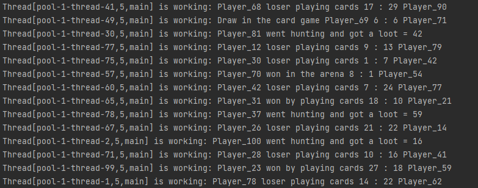

# skytecgames

### ѕроект демонстрирует механику игры, где создаютс€ различные кланы, казначества и игроки.

### ѕосле создани€ вышеперечисленных объеков, действи€ игроков происходит в рандомном пор€дке некоторое количество раз, т.е. после создани€ игрока, он об€зательно вступает в клан и может сходить на арену, сыграть в карты, вз€ть задание или поохотьс€.

### ѕри этом, от каждого действи€ игрока и получени€ монет, часть средств направл€етс€ в казну на содержание клана.   примеру, игрок сходил на охоту и получил лут на 80 монет, 25%, т.е. 20 монет из них отчисл€етс€ в казну.

### ¬се денежные действи€ игроков регистрируютс€ в журнале (таблица Details), где, в случае необходимости, можно посмотреть кто, когда, что сделал и сколько монет было переведено в казну клана, также информаци€ о состо€нии казны до и после действи€.

### ѕереда запуском добавьте Ѕƒ в idea, указав в пол€х:   Path: \~/dataBaseH2.mv.db  URL: jdbc:h2:\~/dataBaseH2

### или установите и откройте Ѕƒ H2, где укажите:   класс драйвера: org.h2.Driver   JDBC URL: jdbc:h2:~/dataBaseH2    ѕароль и им€ пользовател€ оставьте не заполнеными

### ќткройте класс SkytecGamesApplication в папке src/main/java/app, укажите минимум 2 игроков (при битвах на арене или карточных играх соперник подбираетс€ из существующих).

###  огда игрок создаЄтс€ ему начисл€етс€ 300 монет на баланс, рандомно указываютс€ скиллы дл€ участи€ на арене и в карточных играх.

### ¬ программе настроена многопоточность при создании кланов, игроков, их действий и пр.

## ѕримеры:

